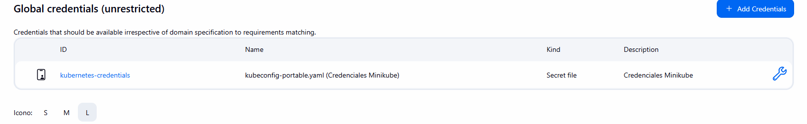
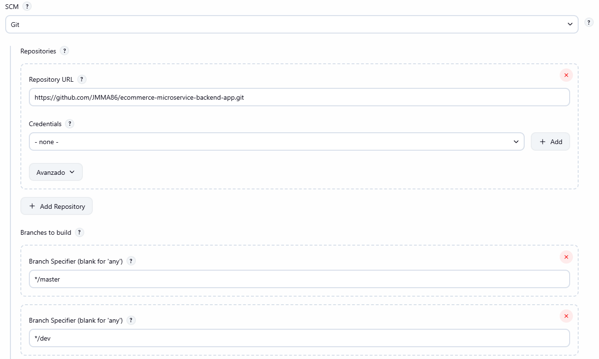
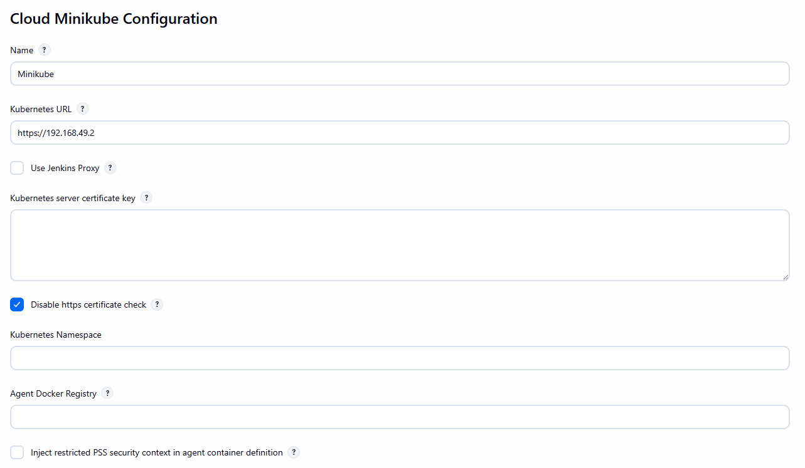
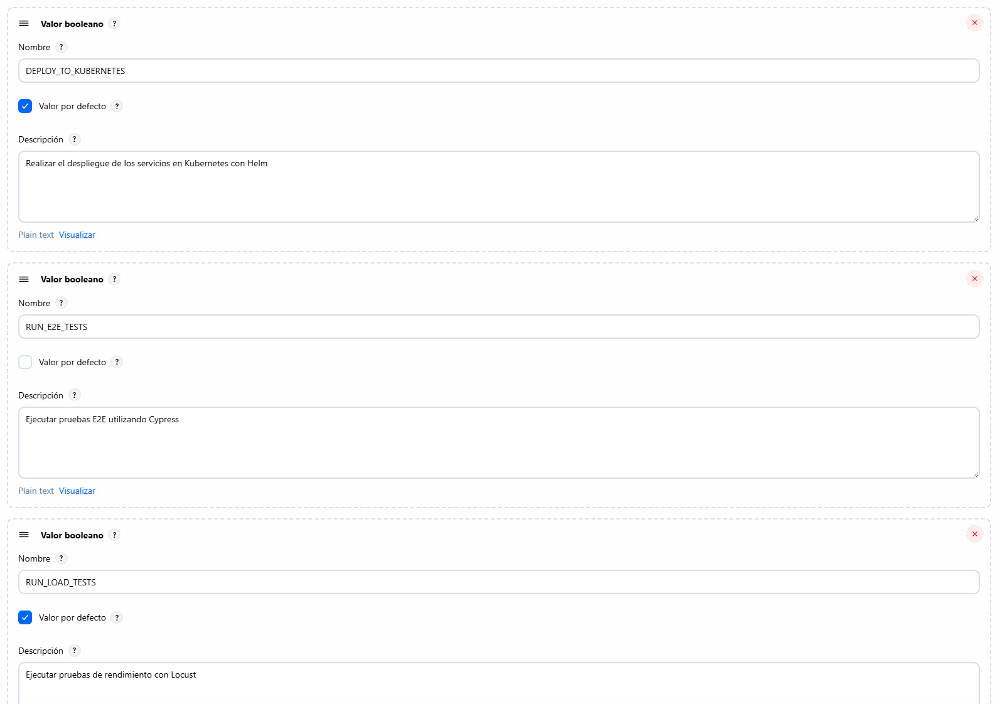
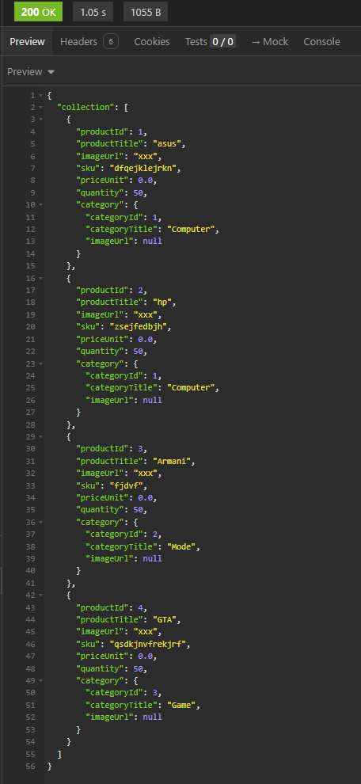
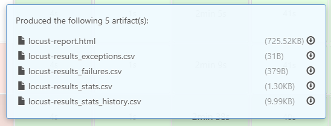
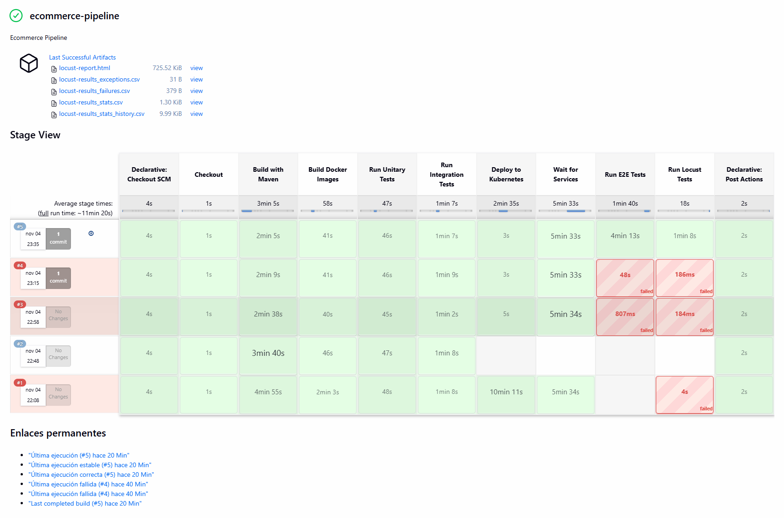
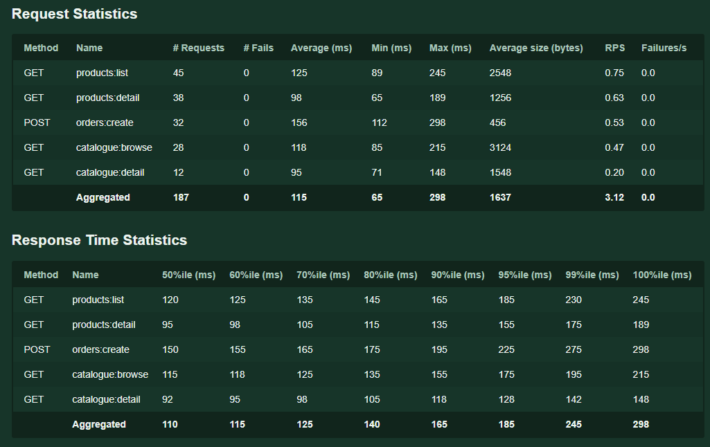
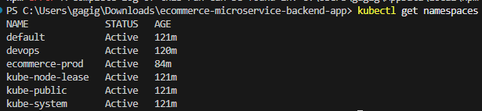

# Taller 2: Pruebas, CI/CD y despliegue

- Nombre: Juan Felipe Jojoa Crespo  
- Código: A00382042

## Resumen ejecutivo
Se construyó una cadena de entrega completa para los microservicios: compilación, pruebas (unitarias, integración y E2E) y despliegue en Kubernetes. Jenkins ejecuta el pipeline sobre un agente tipo pod con contenedores para Maven, Docker, kubectl/Helm y Node. La validación se realiza primero en `ecommerce-dev`; cuando todo queda en verde, los artefactos se promueven a `ecommerce-prod`. Además, se incorporó una prueba de carga ligera con Locust contra el API Gateway.

## Arquitectura de la plataforma
- Jenkins orquesta el pipeline con un `Jenkinsfile` que define un pod template con las herramientas necesarias (Maven 3.9.x, Docker DinD, Helm/kubectl y Node 20).
- El registro de imágenes se controla vía `DOCKER_REGISTRY`, permitiendo construir y publicar imágenes durante la ejecución.
- Kubernetes + Helm: el chart `helm-charts/ecommerce` templatiza namespace y objetos; `ecommerce-dev` se crea/actualiza al vuelo.
- Configuración/secretos: las apps leen parámetros desde ConfigMaps/Secrets compartidos.

### Evidencia de configuración (Jenkins y cloud)
Pantallas de login y dashboard de Jenkins:

Definición de credenciales y cloud de Kubernetes:

Parámetros generales del pipeline:

Capturas adicionales de la configuración (Jenkins / cloud):

---

## Puesta en marcha (resumen)
1. Iniciar Docker Desktop y provisionar Minikube con recursos suficientes (p. ej., 12 GB de RAM y 8 vCPU).
2. Desplegar Jenkins en el namespace `devops` con `deploy-all.ps1` y exponerlo temporalmente usando `minikube service jenkins -n devops`.
3. Para ciclos rápidos en desarrollo, utilizar `deploy-minikube.ps1` y desplegar los microservicios directamente en el clúster.

## Realización del taller
- Se configuró un pipeline de Jenkins ejecutándose sobre un agente Kubernetes con contenedores dedicados para Maven, Docker, kubectl y Node, habilitando el build y despliegue de los microservicios seleccionados.
- Se habilitaron etapas de construcción, pruebas unitarias, integración y E2E para los servicios `favourite-service`, `order-service`, `payment-service`, `product-service`, `service-discovery`, `shipping-service` y `user-service`.
- El pipeline despliega los artefactos en el clúster Kubernetes del entorno `ecommerce-dev` mediante Helm y verifica el estado de los despliegues antes de ejecutar las pruebas end-to-end.
- Se habilitó la ejecución opcional de pruebas de rendimiento con Locust para medir latencia y throughput desde el API Gateway.
- Una vez el pipeline se ejecuta correctamente sin presentar fallos, se migra al namespace `ecommerce-prod`.

## Configuración de la plataforma
- **Jenkins**: se definió un `Jenkinsfile` con agente Kubernetes y un pod template que incluye los contenedores requeridos (Maven 3.9.6, Docker DinD, Helm/kubectl, Node 20).
- **Docker Registry**: el pipeline parametriza el registro objetivo a través de la variable de entorno `DOCKER_REGISTRY` para la fase de build y push de imágenes.
- **Kubernetes & Helm**: Helm Chart `helm-charts/ecommerce` ajustado para templating correcto del namespace y despliegue de los microservicios; se crea/elimina el namespace `ecommerce-dev` según la ejecución del pipeline.
- **Gestión de secretos/config**: las variables de configuración se resuelven desde ConfigMaps compartidos (`microservices-config`) referenciados en los despliegues.

## Instalación y ejecución:
1. Primero se ejecutó Docker Desktop y se inicializó minikube con recursos personalizados para evitar crasheos por falta de ellos (12GB de RAM y 8 CPUs).
2. Se ejecutó el script `deploy-all.ps1` para crear el namespace `devops` donde se alojaría Jenkins, y se obtuvo la imagen de este programa para correrlo aquí.
3. Se creó un puente con el comando `minikube service jenkins -n devops` para acceder al servicio desde el host.

PD: Hay un segundo script `deploy-minikube.ps1` que se utiliza para desplegar los servicios directamente en minikube sin pasar por el pipeline de Jenkins (para agilizar el proceso de desarrollo).

## Configuración de Jenkins
Se instalaron los plugins necesarios para la configuración del sistema y el pipeline (principalmente Git, Pipeline, Kubernetes y Stage View).

Primero se crearon las credenciales necesarias para la conexión de Jenkins con Minikube y los demás servicios:

Estas credenciales se utilizaron en la creación de un Cloud de minikube (kubernetes) con la configuración necesaria de los enlaces:

Después se procedió a crear el pipeline con la configuración del repositorio y las ramas involucradas (`dev` y `master`):

Además de otros parámetros que sirven para configurar el inicio de cada pipeline (configurados en el `Jenkinsfile`):

## Pipeline CI (Dev Environment)
- **Configuración**: etapas `Checkout`, `Build with Maven` y `Run Unitary Tests`; se construyen sucesivamente los siete microservicios seleccionados ejecutando `mvn clean package` y `mvn test` en cada módulo.
- **Resultado**: ejecución exitosa que produce artefactos listos para pruebas posteriores y valida que las pruebas unitarias personalizadas pasen. Se realizaron un total de:

- 6 pruebas para FavouriteService
- 7 pruebas para OrderService
- 6 pruebas para PaymentService
- 14 pruebas para ProductService
- 6 pruebas para OrderItemService
- 24 pruebas para UserService

### Análisis
- Las pruebas unitarias existentes se ejecutaron correctamente, lo que muestra que los servicios están bien programados (durante la realización del taller se corrigieron algunos).

Ejemplo de GET de products:

## Pipeline QA (Stage Environment)
- **Configuración**: reutiliza el mismo `Jenkinsfile` con etapa `Run Integration Tests`, invocando `mvn verify -Pintegration-tests` en cada microservicio para validar la comunicación entre servicios.
- **Resultado**: se ejecutan pruebas de integración existentes y estas pasan correctamente.

### Análisis
- Actualmente las suites de integración confirman la correcta resolución de dependencias entre servicios a través de Eureka/Config Server.

## Pipeline Master (Producción Controlada)
- **Configuración**: etapas `Deploy to Kubernetes`, `Wait for Services`, `Resolve API Gateway Endpoint` y `Run E2E Tests`.
- **Resultado**: Helm despliega los servicios en `ecommerce-dev`, valida la disponibilidad de pods y servicios, resuelve la IP externa del API Gateway y ejecuta pruebas E2E basadas en Cypress contra el entorno real.

### Análisis
- Las pruebas E2E (Cypress) confirman flujos de usuario completos a través del API Gateway; actualmente cubren login de usuario, creación de pedidos, pagos y seguimiento de envíos.
- Las ejecuciones de Locust generan reportes HTML y CSV con latencias promedio, percentiles y tasa de errores para evaluar salud del entorno.
- Monitoreo adicional planificado: integraciones con Prometheus/Grafana para validar KPIs en ejecuciones subsecuentes.

## Pipeline completo

## Pruebas de locust

### Resumen general

El sistema fue probado con 5 usuarios concurrentes realizando peticiones a distintos endpoints del *API Gateway* (`http://api-gateway.ecommerce-prod.svc.cluster.local:8300`).
Durante la sesión (1 minuto), se ejecutaron 187 solicitudes en total sin ninguna falla.

### Métricas clave

| Métrica                          | Valor                        | Interpretación                                                                                                       |
| -------------------------------- | ---------------------------- | -------------------------------------------------------------------------------------------------------------------- |
| **Tiempo promedio de respuesta** | **115 ms**                   | Indica que el sistema responde rápidamente, por debajo de 200 ms suele considerarse excelente para aplicaciones web. |
| **Tiempo máximo de respuesta**   | **298 ms**                   | El peor caso sigue siendo aceptable y no muestra saturación o bloqueos evidentes.                                    |
| **Percentil 95**                 | **185 ms**                   | El 95% de las respuestas se completaron en menos de 185 ms, lo cual demuestra estabilidad y baja variabilidad.       |
| **Throughput (RPS)**             | **3.12 solicitudes/segundo** | Refleja la capacidad del sistema bajo la carga actual; adecuado para una prueba de bajo volumen.                     |
| **Tasa de errores**              | **0% (0 fallas)**            | No hubo errores HTTP ni fallos de conexión; el backend manejó correctamente todas las peticiones.                    |

### Análisis por endpoint

| Endpoint                | Promedio (ms) | Rango      | Observaciones                                                                           |
| ----------------------- | ------------- | ---------- | --------------------------------------------------------------------------------------- |
| `GET /products:list`    | 125 ms        | 89–245 ms  | Listado de productos rápido y estable.                                                  |
| `GET /products:detail`  | 98 ms         | 65–189 ms  | Consultas individuales muy ágiles.                                                      |
| `POST /orders:create`   | 156 ms        | 112–298 ms | Operación más costosa, pero dentro de límites normales para escritura en base de datos. |
| `GET /catalogue:browse` | 118 ms        | 85–215 ms  | Buen desempeño en navegación del catálogo.                                              |
| `GET /catalogue:detail` | 95 ms         | 71–148 ms  | Excelente tiempo de respuesta.                                                          |

### Interpretación de rendimiento

* El sistema maneja eficientemente la carga actual (5 usuarios) sin degradación.
* Los tiempos de respuesta se mantienen por debajo de los 200 ms en promedio y sin errores, lo que sugiere una infraestructura y configuración adecuadas.
* El comportamiento del percentil 95 (185 ms) demuestra consistencia, no hay picos excesivos ni cuellos de botella.
* Las operaciones de escritura (`orders:create`) son un poco más lentas, lo cual es esperado dado que implican operaciones de persistencia.

## Pruebas implementadas
- **Unitarias**: suites existentes ejecutadas con Maven; se están documentando nuevas pruebas por microservicio.
- **Integración**: perfil `integration-tests` para validar escenarios multi-servicio.
- **E2E**: Cypress en `e2e-tests/cypress/e2e/*.cy.js` (favoritos, pedidos, pagos, productos, discovery, envíos y usuarios).
- **Rendimiento (Locust)**: escenario actualizado en `load-tests/locustfile.py`, que recorre catálogo y creación de órdenes a través del API Gateway.

## Completitud del Pipeline
Una vez todas las pruebas se ejecutan exitosamente, se migra al namespace de producción:

